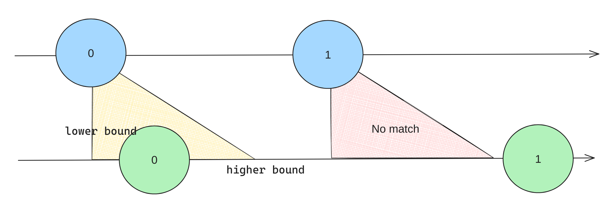
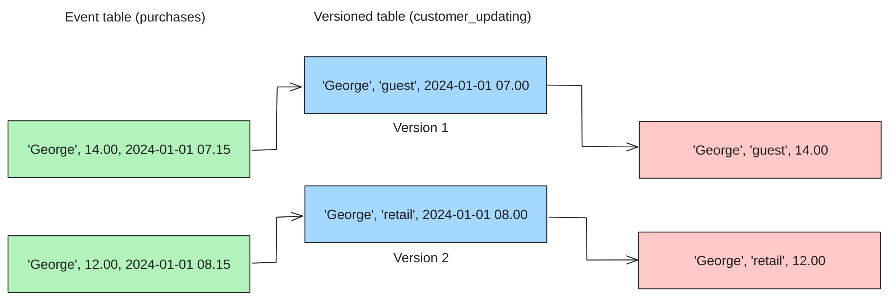

# Temporal Joins

## Interval Join
### What is it?
- An interval join is a join between two tables where the join condition is based on a probe site's time interval.

### Example

1. Create connection to Kafka
```sql
DROP TABLE IF EXISTS `customers_updating`;
-- Create a versioned table with a primary key
CREATE OR REPLACE TABLE `customers_updating` (
    `id` STRING,
    `account_type` STRING,
    `updated_at` TIMESTAMP_LTZ(3),
    WATERMARK FOR `updated_at` AS `updated_at`,
    PRIMARY KEY (`id`) NOT ENFORCED
) WITH (
    'connector' = 'upsert-kafka',
    'topic' = 'customers_updating',
    'properties.bootstrap.servers' = 'broker:29092',
    'properties.group.id' = 'demo-group',
    'properties.sasl.mechanism' = 'PLAIN',
    'key.format' = 'json',
    'value.format' = 'json'
);

DROP TABLE IF EXISTS `purchases`;
-- This is an append-only table
CREATE OR REPLACE TABLE `purchases` (
    `customer_id` STRING,
    `cost` DECIMAL(10, 2),
    `purchased_at` TIMESTAMP_LTZ(3),
    WATERMARK FOR `purchased_at` AS `purchased_at`
) WITH (
    'connector' = 'kafka',
    'topic' = 'purchases',
    'properties.bootstrap.servers' = 'broker:29092',
    'properties.group.id' = 'demo-group',
    'properties.sasl.mechanism' = 'PLAIN',
    'scan.startup.mode' = 'earliest-offset',
    'value.format' = 'json'
);
```
2. 

## Event Time Temporal Join
### What is it?
- A temporal join is a join between one versioned table and another event table.
- The event table is the probe site and the versioned table is the build site. So,
  `event_table LEFT JOIN versioned_table FOR SYSTEM_TIME AS OF event_table.event_time`
- The versioned table must have a primary key.

### Example
Let's say we have a table of customers that is being updated over time. We also have a table of purchases that is being appended over time. We want to join the two tables to see the account type of the customer at the time of the purchase.

1. Create connection to Kafka
```sql
DROP TABLE IF EXISTS `customers_updating`;
-- Create a versioned table with a primary key
CREATE OR REPLACE TABLE `customers_updating` (
    `id` STRING,
    `account_type` STRING,
    `updated_at` TIMESTAMP_LTZ(3),
    WATERMARK FOR `updated_at` AS `updated_at`,
    PRIMARY KEY (`id`) NOT ENFORCED
) WITH (
    'connector' = 'upsert-kafka',
    'topic' = 'customers_updating',
    'properties.bootstrap.servers' = 'broker:29092',
    'properties.group.id' = 'demo-group',
    'properties.sasl.mechanism' = 'PLAIN',
    'key.format' = 'json',
    'value.format' = 'json'
);

DROP TABLE IF EXISTS `purchases`;
-- This is an append-only table
CREATE OR REPLACE TABLE `purchases` (
    `customer_id` STRING,
    `cost` DECIMAL(10, 2),
    `purchased_at` TIMESTAMP_LTZ(3),
    WATERMARK FOR `purchased_at` AS `purchased_at`
) WITH (
    'connector' = 'kafka',
    'topic' = 'purchases',
    'properties.bootstrap.servers' = 'broker:29092',
    'properties.group.id' = 'demo-group',
    'properties.sasl.mechanism' = 'PLAIN',
    'scan.startup.mode' = 'earliest-offset',
    'value.format' = 'json'
);
```
2. Insert data into Kafka
```sql
INSERT INTO customers_updating VALUES ('George', 'guest', NOW());
INSERT INTO customers_updating VALUES ('George', 'retail', NOW());
INSERT INTO purchases VALUES ('George', 14.00, NOW());
INSERT INTO purchases VALUES ('George', 25.00, NOW());
```
3. Create temporal join
```sql
SELECT customer_id, account_type, cost, updated_at, purchased_at
FROM purchases 
LEFT JOIN customers_updating FOR SYSTEM_TIME AS OF purchases.purchased_at
ON purchases.customer_id = customers_updating.id;
```

### Considerations
- Be aware that watermarks will prevent the join to happen if the watermark is not reached. You will need to publish a message with a timestamp greater than the watermark to trigger the join.
- Versioned table may contain multiple versions of the same key. Old rows will be removed once the probe site watermark is greater than the row's timestamp.